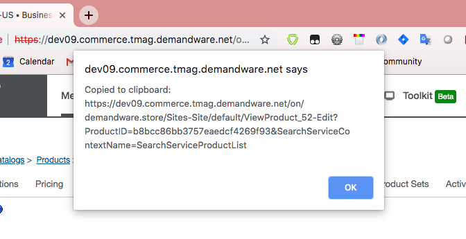

**[↤ Bookmarklets](../README.md#Bookmarklets)**

`Share Business Manager Link`
---

> take the current webpagee URL, strip its CSRF, and copy the resulting URL to your clipboard



## Introduction

Often URLs inside business manager will contain a CSRF query parameter.  Copying and sharing this link with others will result in the other user seeing an error regarding an expired CSRF. 
When clicked, this bookmarklet will take the current webpagee URL, strip its CSRF, and copy the resulting URL to your clipboard

**Note** While this bookmarklet will work for many areas inside of Business Manager, it will not work with all of them.  Before sending your copied link to another user, it is helpful to open a new browser tab and verify the URL takes you to where you expect to go.

## Installation

Make a new bookmark in your browser (right-click on the [bookmarks bar](https://support.google.com/chrome/answer/95745?hl=en) and click `Add Page...`)
  - For "Name" put "Share BM URL"  You can change it to something else if you prefer
  - Copy the code below and paste it into the "URL" field of the new bookmark.

```
javascript:(function()%7B(function%20(text)%20%7Bvar%20node%20%3D%20document.createElement('textarea')%3Bvar%20selection%20%3D%20document.getSelection()%3Bnode.textContent%20%3D%20text%3Bdocument.body.appendChild(node)%3Bselection.removeAllRanges()%3Bnode.select()%3Bdocument.execCommand('copy')%3Bselection.removeAllRanges()%3Bdocument.body.removeChild(node)%3Balert(%22Copied%20to%20clipboard%3A%5Cn%22%20%2B%20text)%3B%7D)((function()%7Bvar%20baseUrl%20%3D%20%5Bdocument.location.protocol%2C%20'%2F%2F'%2C%20document.location.host%2C%20document.location.pathname%5D.join('')%3Bvar%20hash%20%3D%20document.location.hash.toString()%3Bvar%20urlParams%20%3D%20new%20URLSearchParams(document.location.search)%3BurlParams.delete('csrf_token')%3Breturn%20baseUrl%20%2B%20%22%3F%22%20%2B%20urlParams.toString()%20%2B%20hash%3B%7D)())%7D)()
```

## Usage

In Business Manager, with a site selected, navigate to `Merchant Tools >  Products and Catalogs >  Products`.  Click the "Find" button to show your list of Products, then click the name of the first product.  
That will bring you to a page listing all of the products's attributes.  In your bookmarks bar, click the bookmarklet.  An alert will show you what URL was copied to your clipboard.  Open a new browser tab and paste the URL into the address bar.  Note that you will be taken directly to the product you were viewing.


## Original Code

```javascript
(function (text) {
  // Creating a text area allows us to later copy it's contents
  var node = document.createElement('textarea');
  var selection = document.getSelection();

  node.textContent = text;
  document.body.appendChild(node);

  selection.removeAllRanges();
  node.select();
  document.execCommand('copy');

  selection.removeAllRanges();
  document.body.removeChild(node);

  alert("Copied to clipboard:\n" + text);

})((function(){

  var baseUrl = [document.location.protocol, '//', document.location.host, document.location.pathname].join('');
  var hash = document.location.hash.toString();
  var urlParams = new URLSearchParams(document.location.search);
  urlParams.delete('csrf_token');

  return baseUrl + "?" + urlParams.toString() + hash;
})());
```