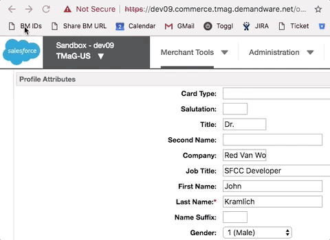

**[↤ Bookmarklets](../README.md#Bookmarklets)**

`Show Unique Identifiers`
---

> Show unique IDs for each attribute



## Introduction

On pages such as Products, Content Assets, and Custom Preferences, clicking on this bookmarklet will show the unique IDs for each attribute.

## Installation

Make a new bookmark in your browser (right-click on the [bookmarks bar](https://support.google.com/chrome/answer/95745?hl=en) and click `Add Page...`)
  - For "Name" put "BM IDs"  You can change it to something else if you prefer
  - Copy the code below and paste it into the "URL" field of the new bookmark.

```
javascript:(function()%7B(function()%7Blet%20%24%20%3D%20jQuery%2CtextColor%20%3D%20'%23dd0e3a'%3Bif(%20!%20%24('html').hasClass('rvw-ids'))%7B%24('dw%5C%5C%3Ainput-label%5Bdw-label-text%5D').each(function()%7Blet%20item%20%3D%20%24(this)%2ClabelText%20%3D%20%24(this).attr('dw-label-text').split(%22%5B'c_%22)%5B1%5D.split(%22'%5D%22)%5B0%5D%2Cdiv%20%3D%20%24('%3Cdiv%3E')%3Bdiv.css(%7Bcolor%3AtextColor%7D).text(labelText)%3B%24(this).find('label').append(div)%3B%7D)%3B%24('span%5Bdata-dw-tooltip%5D').each(function()%7Blet%20item%20%3D%20%24(this)%2ClabelText%20%3D%20%24(item).attr('data-dw-tooltip').split(%2F%5C.(.%2B)%2F)%5B1%5D%2Cdiv%20%3D%20%24('%3Cdiv%3E')%3Bdiv.css(%7Bcolor%3AtextColor%7D).text(labelText)%3Bitem.parent().append(div)%3B%7D)%3B%24('html').addClass('rvw-ids')%3B%7D%7D)()%7D)()
```

## Usage

In Business Manager, with a site selected, navigate to `Merchant Tools >  Customers >  Customers`.  Click the "Find" button to show your list of customers, then click the email address of the first customer.  
That will bring you to a page listing all of the customer's attributes.  In your bookmarks bar, click the bookmarklet, and the unique identifiers for each attribute will be placed on the page in red text, underneath the human readable names.


## Original Code

```javascript
(function(){
  let $ = jQuery,
      textColor = '#dd0e3a';  // Red Van Workshop Red

  // Make sure we only run this once
  if( ! $('html').hasClass('rvw-ids')){

    // Custom Preferences Section
    $('dw\\:input-label[dw-label-text]').each(function(){
      let item = $(this),
          labelText = $(this).attr('dw-label-text').split("['c_")[1].split("']")[0],
          div = $('<div>');

      div
        .css({color:textColor})
        .text(labelText);

      $(this).find('label').append(div);
    });

    // Product and Others
    $('span[data-dw-tooltip]').each(function(){
      let item = $(this),
          labelText = $(item).attr('data-dw-tooltip').split(/\.(.+)/)[1],
          div = $('<div>');

      div
        .css({color:textColor})
        .text(labelText);

      item.parent().append(div);
    });

    $('html').addClass('rvw-ids');
  }

})();
```